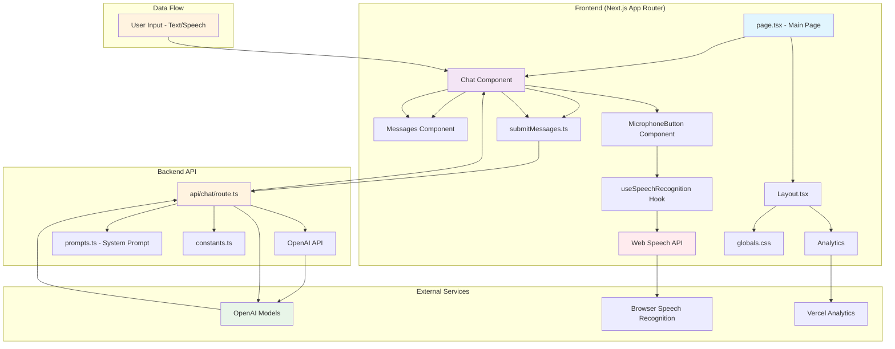
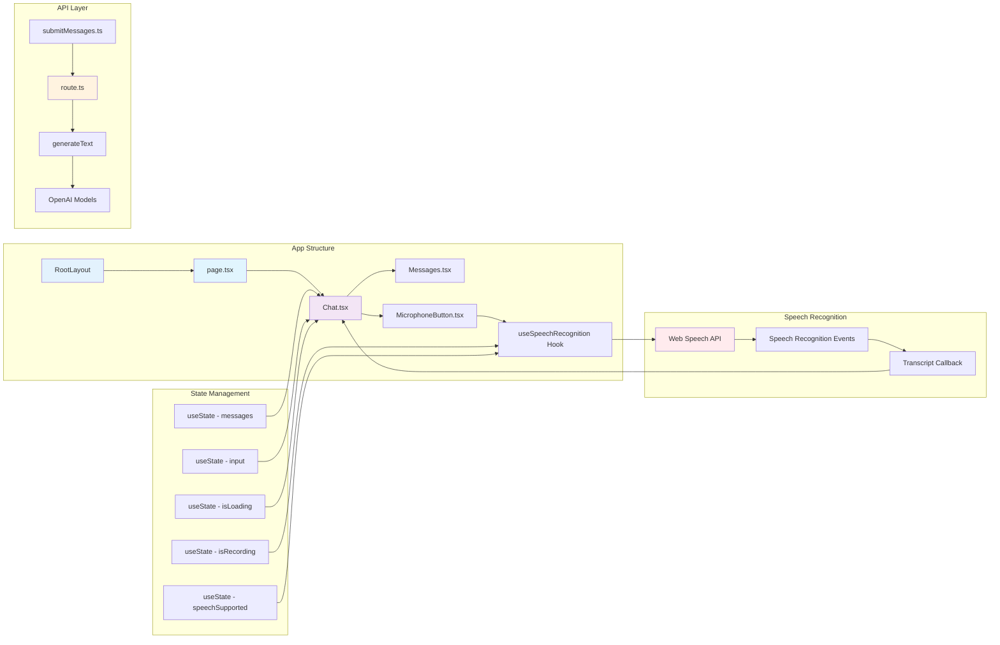
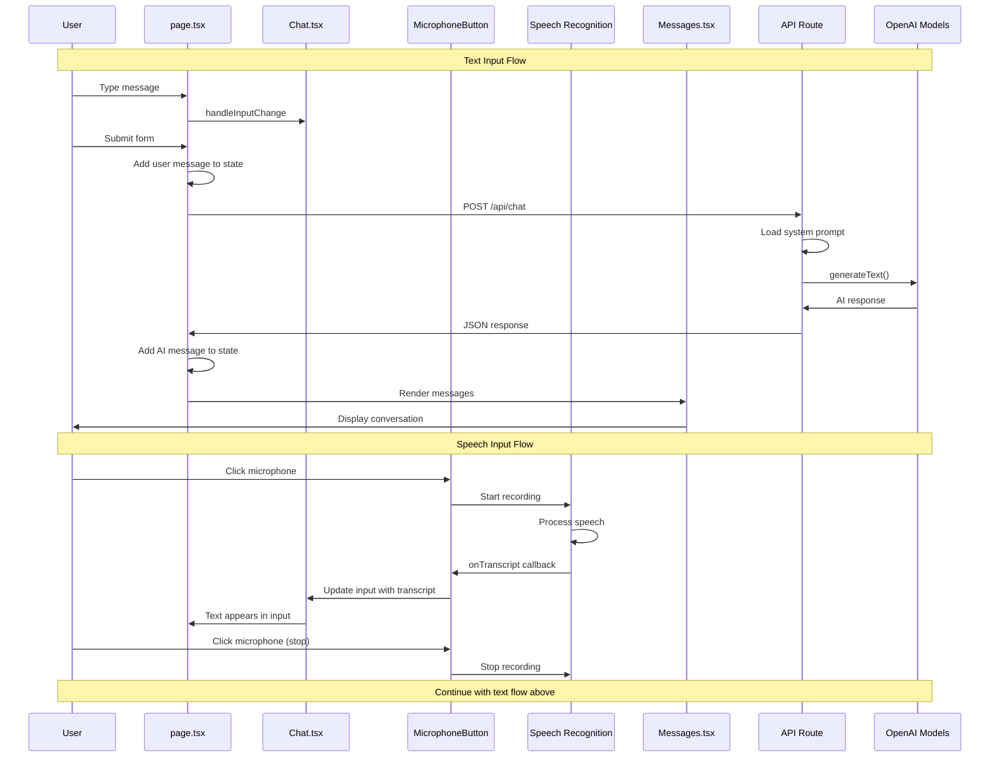
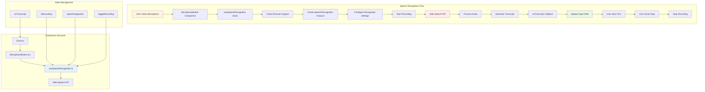
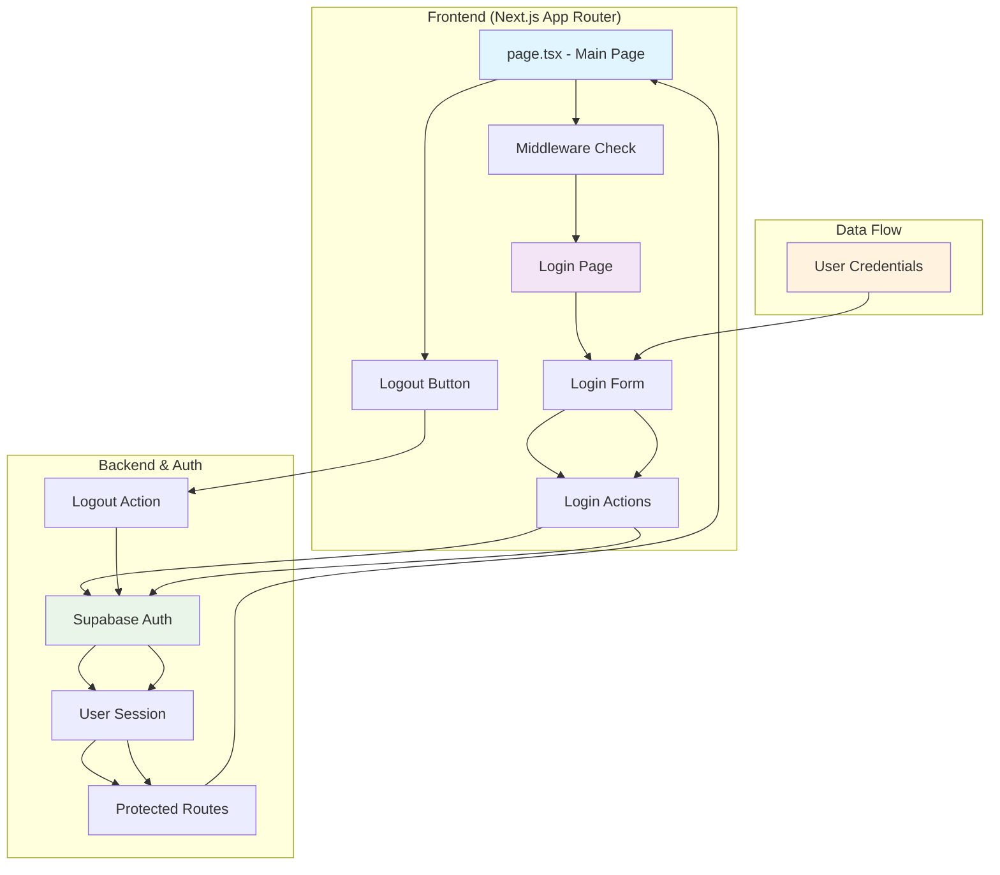
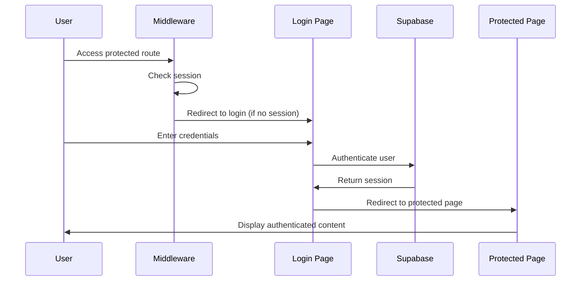
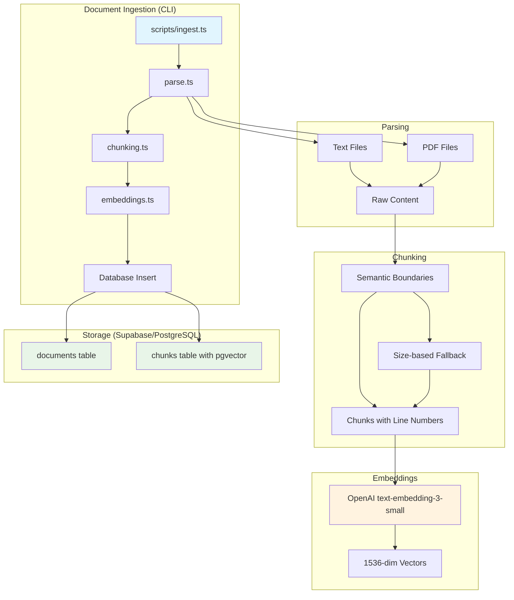
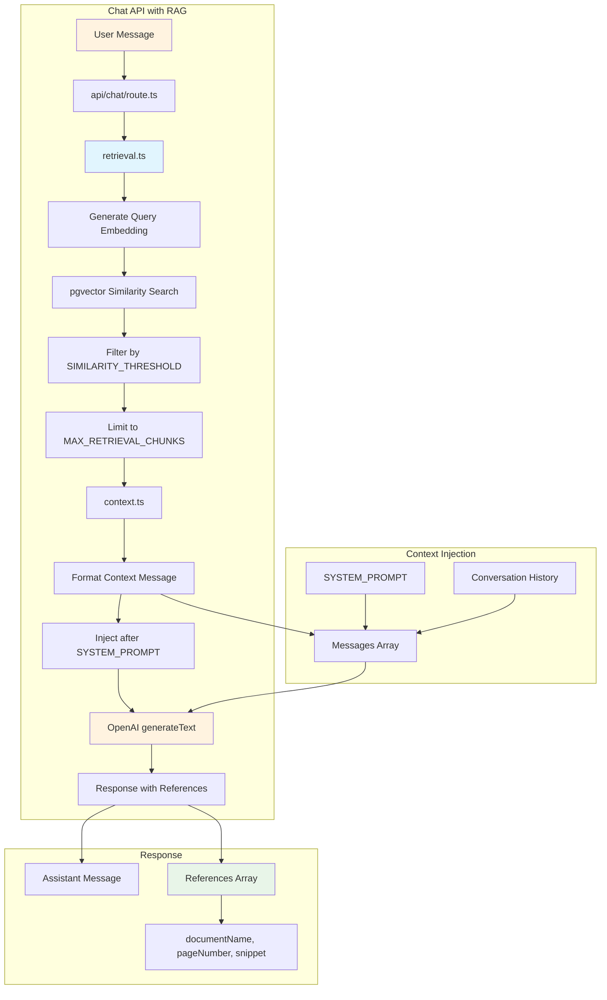
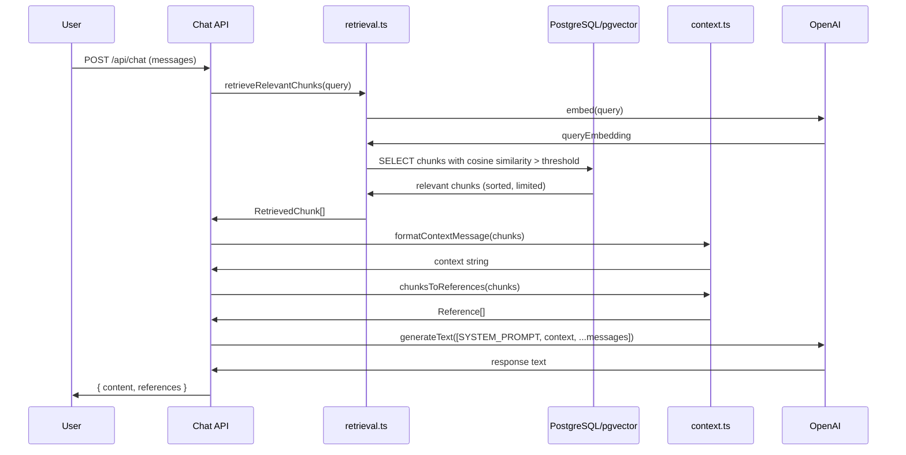

# Current Architecture - Siebert Science AI

## System Overview

## Component Architecture

## Data Flow Architecture

## Speech Recognition Architecture

## Authentication Architecture

## Login Flow Sequence

## RAG Pipeline Architecture (Phase 1-2: Ingestion)

### RAG Database Schema

**documents table:**
- `id` (UUID, PK)
- `filename`, `originalName`, `storagePath`
- `mimeType`, `fileSize`
- `uploadedAt`, `uploadedBy`

**chunks table:**
- `id` (UUID, PK)
- `documentId` (FK → documents)
- `content`, `embedding` (vector 1536)
- `chunkIndex`, `pageNumber`, `lineStart`, `lineEnd`
- `metadata` (JSONB)
- `createdAt`

### Key Files

| File | Purpose |
|------|---------|
| `src/db/schema.ts` | Drizzle schema definitions |
| `src/db/index.ts` | Drizzle client initialization |
| `src/lib/rag/types.ts` | TypeScript interfaces |
| `src/lib/rag/parse.ts` | PDF/text file parsing |
| `src/lib/rag/chunking.ts` | Semantic chunking logic |
| `src/lib/rag/embeddings.ts` | OpenAI embedding generation |
| `src/lib/rag/ingest.ts` | Orchestrates ingestion pipeline |
| `src/lib/rag/retrieval.ts` | Vector similarity search |
| `src/lib/rag/context.ts` | Context formatting for chat |
| `scripts/ingest.ts` | CLI tool for document ingestion |

## RAG Pipeline Architecture (Phase 3: Chat Integration)

### Chat RAG Data Flow

### Graceful Degradation

If RAG retrieval fails (embedding error, database error), the chat API continues without context injection:
- Logs error for debugging
- Returns empty references array
- Chat functions normally using only the system prompt
