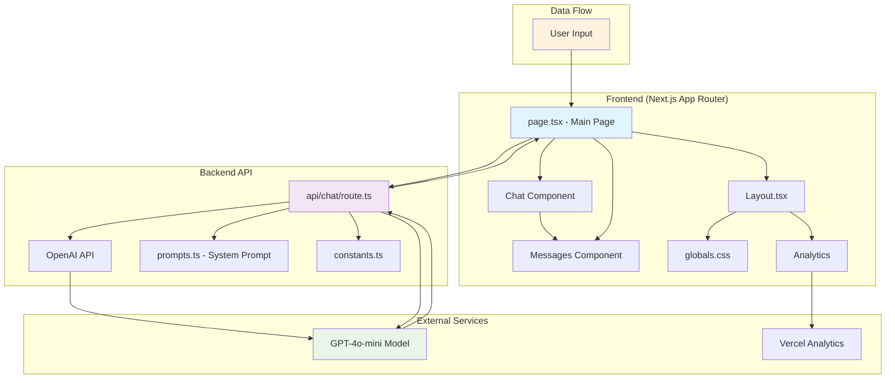
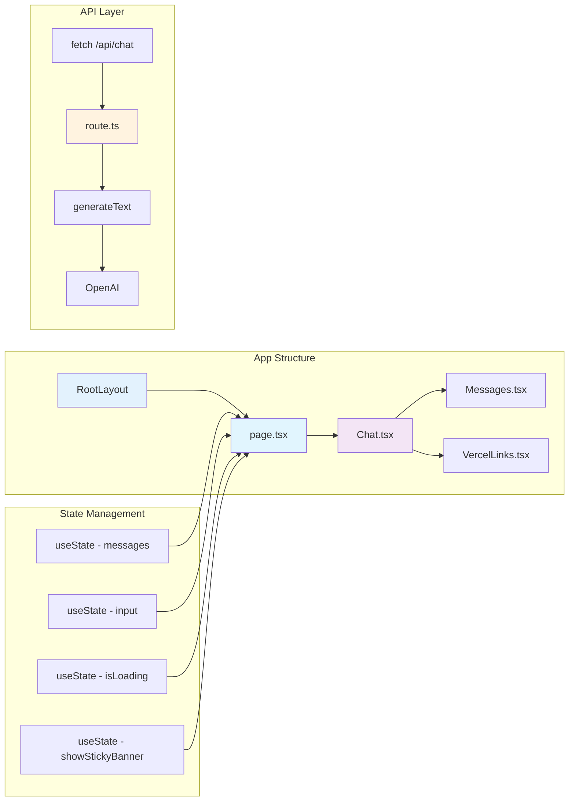
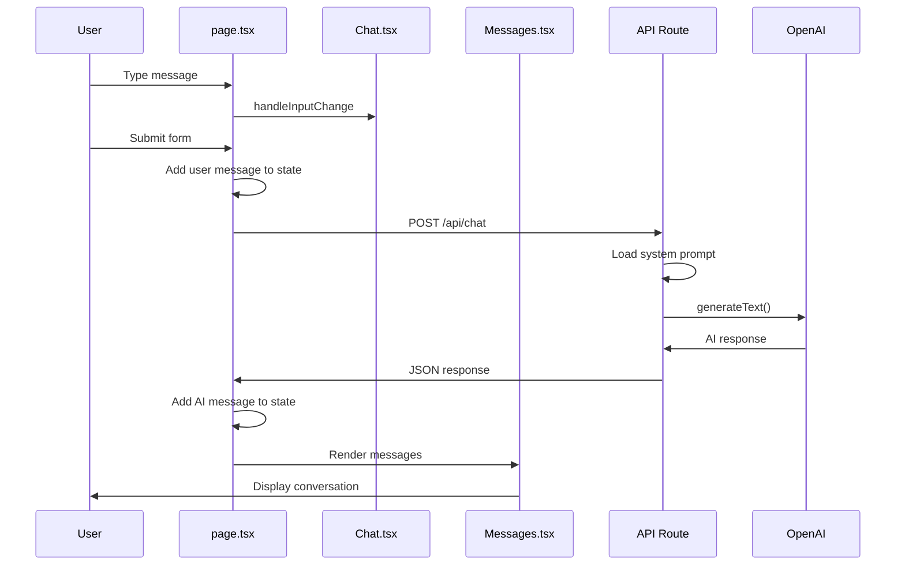

# Current Architecture - Siebert Science AI

## System Overview

```mermaid
graph TB
    subgraph "Frontend (Next.js App Router)"
        A[page.tsx - Main Page] --> B[Chat Component]
        B --> C[Messages Component]
        A --> D[Layout.tsx]
        D --> E[globals.css]
        D --> F[Analytics]
    end

    subgraph "Backend API"
        G[api/chat/route.ts] --> H[OpenAI API]
        G --> I[prompts.ts - System Prompt]
        G --> J[constants.ts]
    end

    subgraph "External Services"
        H --> K[GPT-4o-mini Model]
        F --> L[Vercel Analytics]
    end

    subgraph "Data Flow"
        M[User Input] --> A
        A --> G
        G --> K
        K --> G
        G --> A
        A --> C
    end

    style A fill:#e1f5fe
    style G fill:#f3e5f5
    style K fill:#e8f5e8
    style M fill:#fff3e0
```

## Component Architecture

```mermaid
graph LR
    subgraph "App Structure"
        A[RootLayout] --> B[page.tsx]
        B --> C[Chat.tsx]
        C --> D[Messages.tsx]
        C --> E[VercelLinks.tsx]
    end

    subgraph "State Management"
        F[useState - messages] --> B
        G[useState - input] --> B
        H[useState - isLoading] --> B
        I[useState - showStickyBanner] --> B
    end

    subgraph "API Layer"
        J[fetch /api/chat] --> K[route.ts]
        K --> L[generateText]
        L --> M[OpenAI]
    end

    style A fill:#e3f2fd
    style B fill:#e1f5fe
    style C fill:#f3e5f5
    style K fill:#fff3e0
```

## Data Flow Architecture

```mermaid
sequenceDiagram
    participant U as User
    participant P as page.tsx
    participant C as Chat.tsx
    participant M as Messages.tsx
    participant A as API Route
    participant O as OpenAI

    U->>P: Type message
    P->>C: handleInputChange
    U->>P: Submit form
    P->>P: Add user message to state
    P->>A: POST /api/chat
    A->>A: Load system prompt
    A->>O: generateText()
    O->>A: AI response
    A->>P: JSON response
    P->>P: Add AI message to state
    P->>M: Render messages
    M->>U: Display conversation
```

